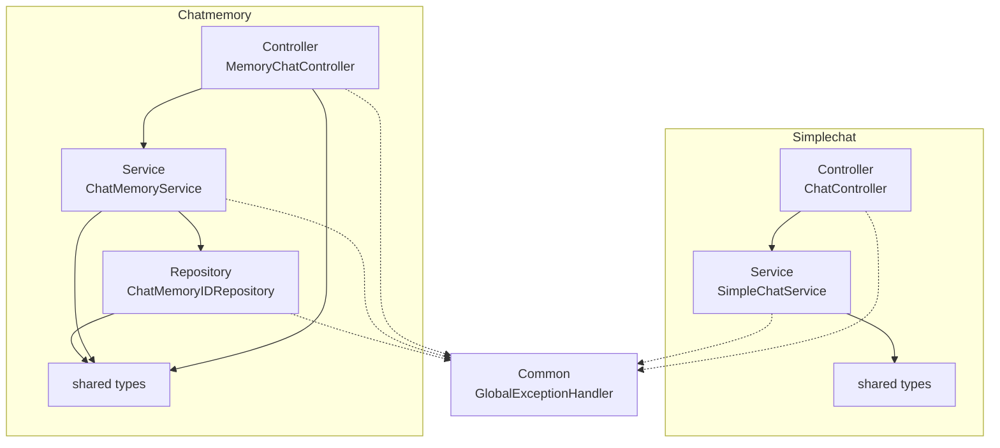

# ai-chat-with-memory

A Kotlin/Spring Boot chat backend on Google Gemini, with two independent verticals: a stateless one-shot chat endpoint and a chat-with-memory endpoint that persists conversation history to Postgres so replies stay in context across turns. Structured as a Spring Modulith app so each feature's controller → service → repository stack is enforced at build time, not just by convention.

## Module boundaries

<!-- module-boundary-map:start -->

<!-- module-boundary-map:end -->
