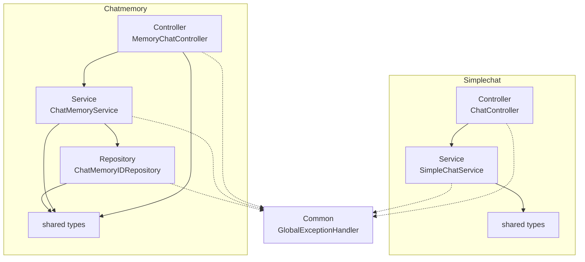

# ai-chat-with-memory

[](https://kotlinlang.org)
[](https://spring.io/projects/spring-boot)
[](https://spring.io/projects/spring-ai)
[](https://spring.io/projects/spring-modulith)
[](https://www.postgresql.org)
[](https://angular.dev)
[](https://gradle.org)

A Kotlin and Spring Boot backend that demonstrates a disciplined modular monolith: two independent chat features (a stateless one-shot endpoint and a persistent chat-with-memory endpoint on Google Gemini) built as Spring Modulith modules whose boundaries are enforced at build time, documented by a diagram generated from the code, and covered by tests that run against real Postgres.

## Design decisions

- **Modular monolith, enforced not suggested.** Each feature owns its full controller → service → repository stack. Spring Modulith's `verify()` runs as a test and fails the build on any cross-module access, so the boundaries cannot rot. The diagram below is regenerated from the real module structure on every build, so the docs cannot drift from the code.
- **Clear ownership of persistence.** Spring AI owns conversation history in its own `spring_ai_chat_memory` table; the app owns only the thin `chat_memory` table for the named-chat concept (id, user, description). Framework owns the generic thing, the app owns the domain thing.
- **Consistency without holding a transaction across the network.** Starting a chat calls the model first and writes the chat-metadata row only on success, so a failed model call leaves nothing behind. No database transaction is held open across the Gemini call by design.
- **Errors as values.** Services return a sealed `ApiResult`, mapped in one place to RFC 7807 `ProblemDetail`. Exceptions are not used for control flow.
- **Tests against real infrastructure.** The repository is tested against a Testcontainers Postgres, not a mock, and the architecture itself is a test.

## Module boundaries

_Generated from the actual module structure on every build. If the code changes, this diagram changes with it._

<!-- module-boundary-map:start -->

<!-- module-boundary-map:end -->

## Running it locally

**Prerequisites**

- JDK 25
- Docker running (Postgres is auto-provisioned in dev and test via Arconia dev services)
- A Google Cloud project with Vertex AI / Gemini enabled, and Application Default Credentials configured

**Configure**

Create `.env.properties` in the project root:

```properties
GEMINI_PROJECT_ID=your-gcp-project-id
```

The model and region are set in `application.properties` (`gemini-2.5-flash`, `europe-west1`).

**Run the backend**

```bash
./gradlew bootRun      # Postgres starts automatically; app on http://localhost:8080
```

**Run the frontend (optional)**

```bash
cd angular-ai
npm install
npm start              
```

## API

| Method | Path                       | Purpose                                        |
|--------|----------------------------|------------------------------------------------|
| POST   | /api/chat                  | Stateless one-shot chat                         |
| POST   | /api/chat-memory/start     | Start a chat (auto-generates a title + reply)  |
| POST   | /api/chat-memory/{chatId}  | Continue a chat, in context                    |
| GET    | /api/chat-memory           | List the user's chats                          |
| GET    | /api/chat-memory/{chatId}  | Fetch a chat's messages                        |

All request bodies are `{ "message": "..." }`. See [`requests.http`](requests.http) for ready-to-run examples.

## Testing and quality

```bash
./gradlew test           # unit + Testcontainers integration tests (needs Docker)
./gradlew ktlintCheck detekt   # formatting and static analysis
./gradlew build          # runs everything, incl. the module-boundary check and diagram regen
```

- **Testcontainers** provisions a real Postgres for repository tests.
- **JaCoCo** produces a coverage report under `build/reports/jacoco`.
- **ktlint** owns formatting; **detekt** owns static analysis (running on default rules with an empty baseline, so nothing is suppressed).
- **Spring Modulith** verifies the module boundaries as part of the test suite.
- **SonarQube** aggregates the reports for a quality overview.

## Known limitations

- Single hardcoded user and no authentication yet. Chats are stored under one default user id.
- The Angular frontend is a thin demo client, not the focus of the project.
